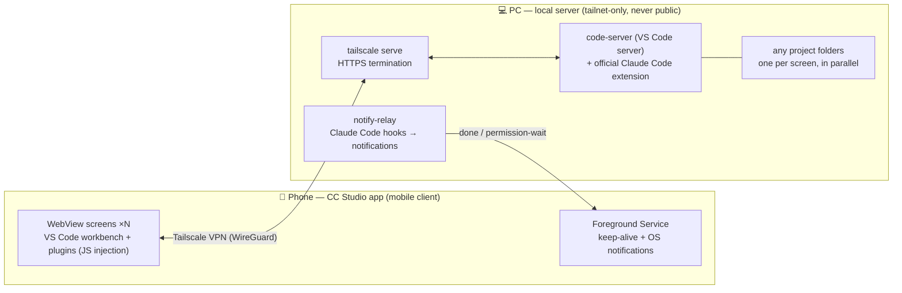

# CC Studio

[日本語](README.md) | **English**

A self-hosted Android app that gives you **the Claude Code running on your PC, from your phone, at
full power**.

- Unlike the official Remote Control — which lets you chat with a session already started on the
  PC — CC Studio can **open any project folder on your PC and start a fresh session from the phone,
  anytime**. Editing is Claude Code's job; VS Code serves as the **viewer** for the results
  (diffs, previews) and as the **file explorer**.
- It runs **Anthropic's official Claude Code extension as-is**. No reimplemented client, so features
  and behavior stay exactly upstream.
- The classic mobile-browser failure — **going to the background kills the connection within
  seconds, and the running turn with it** — is solved: a persistent Foreground Service keeps the
  session alive even with the screen off.

<p align="center">
  
</p>
<p align="center"><sub>Full VS Code + Claude Code in a phone's portrait screen. Fun fact: this very screenshot shows
CC Studio's announcement post being dictated to Claude by voice — the app is advertising itself on itself.</sub></p>

## The big picture

A local server on the PC (code-server + the Claude Code extension + a notification relay), used over
Tailscale by a native app on the phone (WebView + a persistent service).



It builds on the open-source VS Code server (**code-server** / Code-OSS, MIT) and Anthropic's official
**Claude Code extension**, wrapped in a native app's WebView. **None of the open-source code is
modified** — every bug or friction point that surfaces on mobile is fixed from the outside, via the
app's **plugins** (JS injection), a **dedicated notification server**, and **server-side settings plus
small helper extensions**.

The UI vocabulary is unified around two words: **Screen** and **Plugin**.

## What hurts when you use stock code-server on a phone → CC Studio's answer

| Problem on mobile | CC Studio's fix |
|---|---|
| The browser disconnects ~20 s after going to the background, killing the running turn | A persistent Foreground Service keeps the connection alive — in the background and with the display off |
| You never notice when Claude finishes or waits for permission | **Notifications** — OS notifications via the server-side notify-relay + Claude Code hooks. Tap to jump to that screen |
| The soft keyboard pops up on its own (auto-focus misfires) | `keyboard-suppress` plugin — the keyboard appears **only when you tap** the input |
| You **can't copy** text from chat replies or previews | Two plugins: `selectable-text` (long-press → "⧉ Copy" button) and `region-grab` (▢ at the left edge → trace a rectangle to bulk-copy) |
| There is no dedicated **paste** UI | The app doesn't interfere — paste from **Gboard's clipboard** |
| Session-list titles get truncated and unreadable | `session-list-readable` plugin — smaller font + two-line wrapping |
| File links in chat open to a blank page / "Not found" | `chat-link-open` plugin + server-side `cc-open` extension — opens in an editor tab; `.md`/`.html` open as preview |
| File attachments in chat don't work | Wired straight to Android's SAF picker, so images and other files attach reliably |
| Markdown / HTML previews are squeezed into a narrow split | Server settings make **full-size in-tab** previews the default; for HTML, install the marketplace extension `aios-html-auto-preview` which opens previews **as a tab** |
| Tapping an external link navigates away from the workbench | External http(s) links open in the device's default browser |
| File downloads never get saved | Saved to the device's Downloads — including `blob:`/`data:` — with a progress bar |
| You can't tell whether it's busy or the connection dropped | `state-observer` plugin — shows "busy / disconnected" per screen on the ⋮ button, the screen list, and the persistent notification |
| You must run `/remote-control` by hand every time before the mobile app / `claude.ai/code` can drive the session | `rc-autoconnect` plugin — automatically runs `/remote-control` on newly started sessions (and right after a reload) to turn Remote Control on |
| The persistent "Remote Control is active" banner eats the chat area | `rc-indicator` plugin — hides the banner (RC stays on) and shows a slim "R" tab at the left edge instead; tap to toggle RC manually |
| The activity bar and other chrome eat horizontal space, squeezing the chat | `ui-zoom` plugin — shrinks the chrome via viewport scale; shrink ratio, sidebar / UI text sizes and Claude webview scale are **adjustable live** from ⚙ with −/+ steppers (no reload; includes "Reset to defaults") |

## Features

- **Screens** — keep multiple VS Code instances (opened on different folders) alive in parallel and
  switch between them like browser tabs. The `⋮` button at the left edge opens the full-screen
  switcher. Tap to switch, `⟳` to reload (with a confirmation dialog if the screen is busy),
  swipe left to delete, `＋ New screen` to add. Restored after a restart.

<p align="center">
  
</p>
<p align="center"><sub>The screen list. Looks like browser tabs, but every one of them stays alive in the
background — queue up the next job while Claude is thinking hard on another screen.</sub></p>

- **Plugins** — `.js` files that remove mobile friction; toggle / add / delete them on the full-screen
  management screen. Eleven bundled plugins live in [`plugins/`](plugins/) (the ones in the table above
  plus the diagnostic `focus-hud` / `select-diag`). Plugins with `@setting` are configurable via ⚙,
  and changes apply **live, no reload needed**. To write your own, see
  [docs/specs/2026-07-02-architecture-and-implementation-notes.md](docs/specs/2026-07-02-architecture-and-implementation-notes.md).

<p align="center">
  
</p>
<p align="center"><sub>Plugin management. Each mobile pain point gets exactly one plugin — and each
description doubles as a record of the bug it kills.</sub></p>

- **Notifications** — OS notifications for Claude Code's **turn completion** and **permission waits**
  (suppressed for the screen you are currently viewing). Toggle each kind under switcher →
  Notifications. Tapping a notification jumps to the screen for that folder (creating one if needed).
- **Server connection** — set the workbench's connection (an HTTPS domain) and the folder to open
  first **from inside the app** (switcher → Settings → **Server** / **Folder to open first**, two
  separate entries). The connection accepts HTTPS domains only (raw IPs are rejected — the official
  extension needs a certificate). When connected, you can browse the server's directories to pick the
  initial folder. Settings are saved to a file and survive process death and app updates. Only when the
  host actually changes does it ask whether to reopen screens on the new host.
- **Copy & paste** — copy with the two plugins above (long-press / rectangle). Paste with Gboard's
  clipboard (the clipboard icon above the keyboard).
- **Observer log** — switcher → Log shows a timeline of busy/connection/unexpected-cancel records
  (⬇ saves to Downloads). Used for bug hunting; also auto-collected to the server.
- **Display language** — follows the device language (Japanese / English), overridable under
  switcher → Settings → Language.

## Security

**Tailnet-only, never public.** The server is not exposed to the internet at all; it is reachable only
from inside Tailscale (a WireGuard VPN). Device auth and encryption are Tailscale's job, HTTPS
(required by the Claude Code extension) is terminated by `tailscale serve`, and code-server itself
still has a randomly generated password. The app deliberately has no auth layer of its own.

## Install

**[INSTALL.md](INSTALL.md)** walks through everything: Tailscale → server setup (one command) →
HTTPS → building the app → first-run setup on the phone. The short version:

```bash
./server/provision/setup.sh                # server: code-server + extensions + notifications
tailscale serve --bg 127.0.0.1:8088        # once, on the front host (Windows side if WSL)
tailscale serve --bg --set-path /cc-notify http://127.0.0.1:8770
./gradlew assembleDebug                    # build the app (set the connection in-app via Settings → Server; the local.properties URL is just an optional first-run seed)
```

## Usage

- **Add / switch screens**: `⋮` at the left edge → switcher. `＋ New screen` opens the default
  folder. Open the folder you want inside VS Code and the screen's title (folder name) follows.
  Tap a row to switch, `⟳` to reload, swipe left → `Delete` to close.
- **Install a plugin**: `⋮` → switcher → **Plugins** → `＋ Add plugin` and pick a `.js` file.
  Toggle it ON, go back to the switcher, and `⟳`-reload the screens where you want it active
  (busy screens can be left alone).
- **Copy**: **long-press** text → adjust the handles → "⧉ Copy". For wide areas like tables or
  logs, tap **▢** at the left edge → trace a rectangle → bulk copy.
- **Paste**: tap the input to bring up the keyboard, then paste from **Gboard's clipboard**.
- **Notification kinds**: `⋮` → switcher → **Notifications** (toggle Done / Permission-wait
  individually).

## Status

- Connection keep-alive, WebView wrapping, notifications, and the copy plugins are **verified on a
  real device**.
- Investigation of unexpected cancels (a running tool stopping on its own) is ongoing, using the
  observer-log feature (see the 2026-07 notes in [docs/notes/](docs/notes/)).

## Documentation

| Document | Contents |
|---|---|
| [INSTALL.md](INSTALL.md) | Full install walkthrough (Tailscale / server / HTTPS / app / first-run) |
| [server/provision/README.md](server/provision/README.md) | Server-side details (tunables, adding extensions, the notification server) |
| [docs/specs/2026-07-02-architecture-and-implementation-notes.md](docs/specs/2026-07-02-architecture-and-implementation-notes.md) | Architecture, implementation notes, repo layout, plugin spec |
| [docs/specs/](docs/specs/) | Per-feature design documents |

Most design documents and development notes under `docs/` are written in Japanese — they are the
project's working records, published as-is.

## License

[MIT](LICENSE). The bundled [code-server](https://github.com/coder/code-server) (submodule) is MIT
as well.
