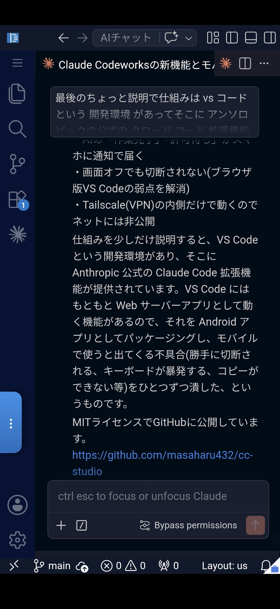
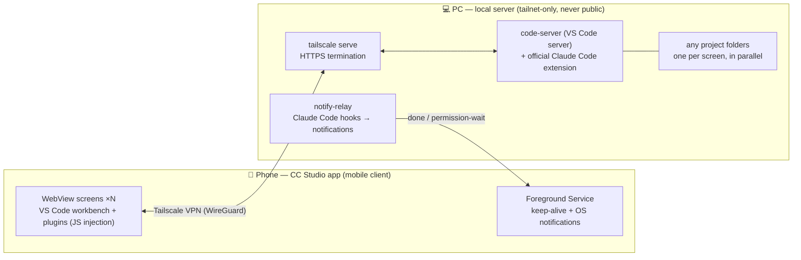
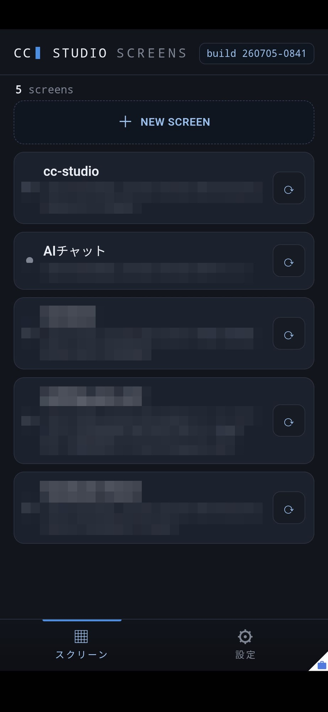
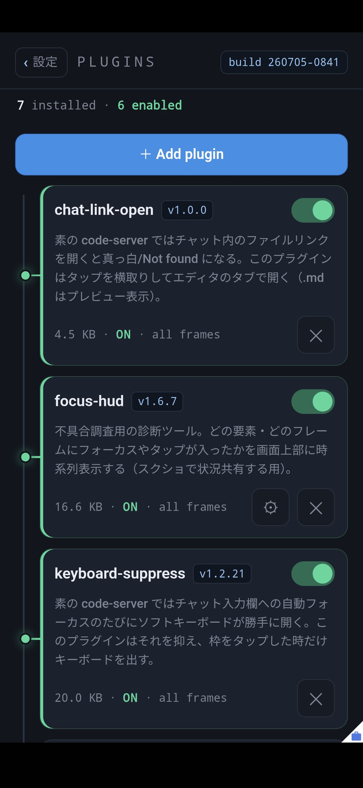

# CC Studio

**日本語** | [English](README.en.md)

**PC で動く Claude Code を、スマホからフル機能のまま使う**ための自前ホスト Android アプリ。

- 公式の Remote Control が「PC 側で立ち上げ済みのセッションをチャットで操作する」ものなのに対し、
  CC Studio は **PC 上の好きなプロジェクトフォルダを開いて、スマホからいつでも新しいセッションを
  開始できる**。編集は Claude Code に任せる前提で、VS Code は成果物の**ビューワー**
  （diff・プレビュー）と**ファイラー**として機能する。
- 使うのは **Anthropic 公式の Claude Code 拡張そのもの**。独自クライアントの再実装ではないので、
  機能も挙動も本家のまま。
- ブラウザ利用の宿命だった「**裏に回ると数十秒で切断され、実行中のセッション処理が死ぬ**」問題は、
  常駐サービスによる接続維持で解決済み。画面を消しても切れない。

<p align="center">
  
</p>
<p align="center"><sub>スマホの縦画面にフルの VS Code + Claude Code。ちなみにこのスクショ、まさに CC Studio の紹介文を
音声入力で Claude に書かせているところ — つまりこのアプリはこのアプリの上で宣伝されている。</sub></p>

## 全体像

PC 側のローカルサーバ（code-server + Claude Code 拡張 + 通知サーバ）を、スマホ側のネイティブ
アプリ（WebView + 常駐サービス）が Tailscale 越しに使う構成。



土台はオープンソースの VS Code サーバ（**code-server** / Code-OSS, MIT）と Anthropic 公式の
**Claude Code 拡張**。これをネイティブアプリの WebView で包む。**オープンソース側のソースコードは
一切改変していない** — モバイルで使うと顔を出す不具合・摩擦は、アプリの**プラグイン**（JS 注入）、
**独自の通知サーバ**、**サーバ側の設定と小さな補助拡張**で、すべて外側から回収する。

UI 語彙は **Screen / スクリーン** と **Plugin / プラグイン** の 2 語に統一している。

## 素の code-server をスマホで使うと何が困るか → CC Studio の答え

| モバイルでの問題 | CC Studio の対処 |
|---|---|
| ブラウザだと裏に回った ~20 秒後に切断され、実行中のターンが死ぬ | 常駐サービス（Foreground Service）が接続を維持。裏でも画面オフでも切れない |
| Claude の完了・許可待ちに気づけない | **通知** — サーバ側の notify-relay + Claude Code フック経由で OS 通知。タップでそのスクリーンへ移動 |
| ソフトキーボードが勝手に出てくる（自動フォーカス暴発） | `keyboard-suppress` プラグイン — 入力欄を**タップした時だけ**キーボードを出す |
| チャットの返信やプレビューの文字を**コピーできない** | `selectable-text`（長押し →「⧉ コピー」ボタン）と `region-grab`（左端 ▢ → 指で範囲を囲んで一括コピー）の 2 方式 |
| **ペースト**の専用 UI が無い | アプリは細工しない。**Gboard（Google キーボード）のクリップボード機能**から貼り付ける |
| セッション一覧のタイトルが途切れて読めない | `session-list-readable` プラグイン — フォント縮小＋2 行折返し |
| チャット内のファイルリンクが真っ白／Not found になる | `chat-link-open` プラグイン + サーバ側 `cc-open` 拡張 — エディタのタブで開き、`.md`/`.html` はプレビュー表示 |
| チャット欄のファイル添付が開けない | Android の SAF ピッカーに直結。画像などを確実に添付できる |
| Markdown / HTML のプレビューが横分割で激狭 | サーバ設定で**タブ内フルサイズ**プレビューを既定に。HTML はプレビューを**タブとして開ける**マーケットプレイスの拡張（`aios-html-auto-preview`）をインストールして対応 |
| 外部リンクを踏むと workbench から離脱してしまう | 外部 http(s) リンクは端末の既定ブラウザで開く |
| ファイルのダウンロードが保存されない | `blob:`/`data:` も含めて端末の Downloads へ保存（進捗バー付き） |
| いま処理中なのか・接続が切れたのか分からない | `state-observer` プラグイン — 各スクリーンの「処理中 / 接続切れ」を ⋮ ボタン・スクリーン一覧・常駐通知に表示 |
| セッションを開くたび手動で `/remote-control` しないと公式アプリ／`claude.ai/code` から操作できない | `rc-autoconnect` プラグイン — 新規セッション（およびリロード直後）で `/remote-control` を自動実行して Remote Control を有効化 |
| 「Remote Control is active」バナーがチャットを占領する | `rc-indicator` プラグイン — バナーを隠し（RC は維持）、代わりに左端の細い「R」タブで状態表示。タップで手動オン/オフ |
| アクティビティバー等の外枠 UI が横幅を食い、チャットが狭い | `ui-zoom` プラグイン — 外枠を viewport スケールで縮小。縮小率・サイドバー文字・UI 文字・Claude 表示倍率は ⚙ の −/+ ステッパーで**ライブ調整**（リロード不要・「デフォルトに戻す」付き） |

## 機能

- **Screens（複数スクリーン）** — 別フォルダで開いた複数の VS Code を「スクリーン」として生きたまま
  並行保持し、ブラウザのタブのように切り替える。左端 `⋮` で全画面 switcher。タップで切替、`⟳` で
  リロード（実行中なら確認ダイアログ）、左スワイプで削除、`＋ New screen` で追加。再起動で復元。

<p align="center">
  
</p>
<p align="center"><sub>スクリーン一覧。見た目はブラウザのタブだが、どれも裏で生きている —
別スクリーンで Claude が長考している間に、次の仕事を仕込める。</sub></p>

- **Plugins（プラグイン）** — モバイルの摩擦を潰す `.js` を全画面の管理スクリーンで ON/OFF・追加・削除。
  同梱プラグインは [`plugins/`](plugins/) に 11 本（上表のほか、不具合調査用の `focus-hud` / `select-diag`）。
  `@setting` を持つプラグインは ⚙ から設定でき、**リロード不要でライブ反映**。
  自作プラグインの書き方は [docs/specs/2026-07-02-architecture-and-implementation-notes.md](docs/specs/2026-07-02-architecture-and-implementation-notes.md)。

<p align="center">
  
</p>
<p align="center"><sub>プラグイン管理。「モバイルで困ること 1 つ = プラグイン 1 本」で潰していく。
説明文がそのまま不具合の記録になっているのがポイント。</sub></p>

- **通知** — Claude Code の**ターン完了**と**許可待ち**で OS 通知（見ているスクリーンの分は出さない）。
  種類ごとの ON/OFF は switcher → 通知設定。通知タップで該当フォルダのスクリーンへ移動（無ければ作る）。
- **接続先設定** — ワークベンチの接続先（HTTPS ドメイン）と最初に開くフォルダを**アプリ内で**設定できる
  （switcher → 設定 → **接続先** / **最初に開くフォルダ** の別項目）。接続先は HTTPS ドメインのみ
  （公式拡張が証明書を要求するため IP 直打ちは不可）。初期フォルダは、サーバに接続していれば一覧から
  辿って選べる。設定はファイルに保存され、プロセス終了・アプリ更新後も残る。接続先を実際に変えたときだけ
  「新ホストで開き直すか」を確認する。
- **コピー & ペースト** — コピーは上表の 2 プラグイン（長押し／範囲囲み）。ペーストは Gboard の
  クリップボード機能で行う（キーボード上部のクリップボードアイコン）。
- **観測ログ** — switcher → ログ で、処理中・接続・突発キャンセル等の記録を時系列表示（⬇ で Downloads へ保存）。
  不具合調査用で、サーバへも自動収集される。
- **表示言語** — 端末の言語に追従（日本語 / English）。switcher → 設定 → 言語 で固定もできる。

## セキュリティ

**tailnet 前提・非公開**。サーバはインターネットに一切晒さず、Tailscale（WireGuard VPN）の内側から
だけアクセスできる。端末認証と暗号化は Tailscale が担い、HTTPS（Claude Code 拡張の動作要件）は
`tailscale serve` が終端、code-server 自体にもランダム生成パスワードが付く。アプリ独自の認証層は
持たない設計。

## インストール

Tailscale の導入 → サーバのセットアップ（1 コマンド）→ HTTPS 公開 → アプリのビルド → スマホ初回設定、
の全手順を **[INSTALL.md](INSTALL.md)** にまとめた。最短の流れ:

```bash
./server/provision/setup.sh                # サーバ: code-server + 拡張 + 通知 まで全部
tailscale serve --bg 127.0.0.1:8088        # 前段ホスト（WSL なら Windows 側）で一度だけ
tailscale serve --bg --set-path /cc-notify http://127.0.0.1:8770
./gradlew assembleDebug                    # アプリをビルド（接続先はアプリ内 設定→接続先 で。local.properties の URL は任意の初回シード）
```

## 使い方

- **スクリーンを増やす/切り替える**: 左端 `⋮` → switcher。`＋ New screen` で新規（既定フォルダで開く）。
  VS Code 側で目的のフォルダを開けば、そのスクリーンの見出し（フォルダ名）が変わる。帯タップで切替、
  `⟳` でリロード反映、左スワイプ→`削除`で閉じる。
- **プラグインを入れる**: `⋮` → switcher 下部 SYSTEM の **Plugins** → `＋ Add plugin` で `.js` を選ぶ。
  トグルで ON にしたら、switcher に戻り反映したいスクリーンを `⟳` でリロード（実行中スクリーンはそのまま）。
- **コピーする**: 文字を**長押し** → ハンドルで範囲調整 → 「⧉ コピー」。表・ログなど広い範囲は
  左端の **▢** をタップ → 指で四角く囲む → まとめてコピー。
- **貼り付ける**: 入力欄をタップしてキーボードを出し、**Gboard のクリップボード**から貼り付け。
- **通知の種類を変える**: `⋮` → switcher → **通知設定**（完了 / 許可待ち を個別に ON/OFF）。

## 状態

- 接続維持・WebView ラップ・通知・コピー系プラグイン: **実機で動作確認済み**。
- 突発キャンセル（実行中ツールが勝手に止まる事象）の原因調査を観測ログ機能で継続中
  （[docs/notes/](docs/notes/) の 2026-07 系ノート参照）。

## ドキュメント

| ドキュメント | 内容 |
|---|---|
| [INSTALL.md](INSTALL.md) | インストール全手順（Tailscale / サーバ / HTTPS / アプリ / スマホ初回設定） |
| [server/provision/README.md](server/provision/README.md) | サーバ側の詳細（調整値・拡張の追加・通知サーバ） |
| [docs/specs/2026-07-02-architecture-and-implementation-notes.md](docs/specs/2026-07-02-architecture-and-implementation-notes.md) | アーキテクチャ・実装メモ・リポジトリ構成・プラグイン仕様 |
| [docs/specs/](docs/specs/) | 機能ごとの設計文書 |

## ライセンス

[MIT](LICENSE)。同梱の [code-server](https://github.com/coder/code-server)（サブモジュール）も MIT。
